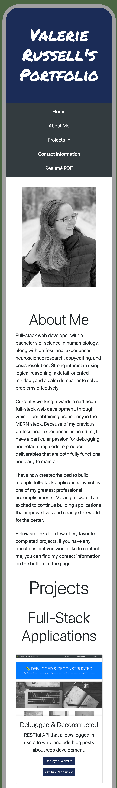

# Portfolio Home Page

## Description

For this project, I built a layout for my personal portfolio with HTML5, CSS3, and Bootstrap. One of my primary objectives was making sure that the entire layout is designed responsively so that it will display properly on any device.

Before adding any personal content, I ensured that everything in the layout was working properly on all viewport widths. I spent a lot of time studying about CSS flexbox properties and troubleshooting unwanted effects related to flexbox. Through that process, I learned that many properties will only work if they are placed on the correct container, not the content itself.

After some revisions, I have implemented several Bootstrap components to ensure that the page is still fully responsive. I have also included many new projects that I have developed.

Please find the deployed application here: https://vruss14.github.io/web-development-portfolio

## Installation

No installation steps are required to view this project. To view the front-end application, visit the URL above. The application's source code can be found on GitHub here: https://github.com/vruss14/web-development-portfolio.

## Usage

This web application is designed for all applications.

Below is a screenshot of the desktop version of the deployed application:

Below is a screenshot of the mobile version of the deployed application:

## Credits

Valerie Russell designed and created this webpage.
